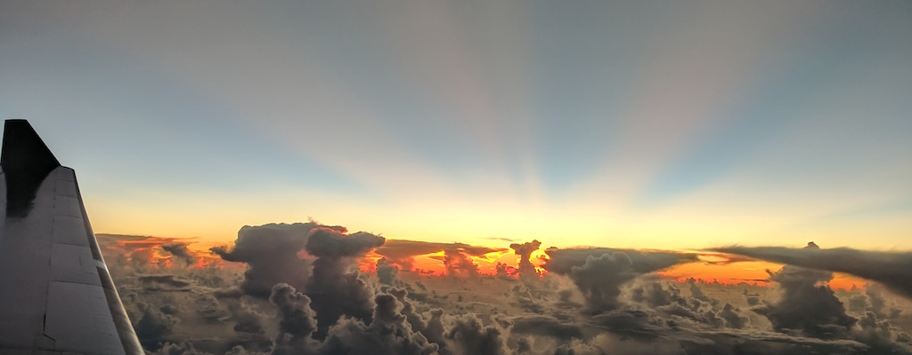

# express-japan-travel



Previous masters app. Reviving...watch this space...

## Run

`node -r esm index.js`

Implementation of ES6 modules in Express requires esm be passed to node.

## Run with google maps

`GMAPKEY=<your-key> node -r esm index.js`

Inject your key into Node's environment variables.

See [Google Maps Platform > Web > Maps JavaScript API > Get an API Key](https://developers.google.com/maps/documentation/javascript/get-api-key)

## Run tests

`./node_modules/mocha/bin/mocha --require esm --exit`

Implementation of ES6 modules in Express requires esm be passed to mocha.

<br>

## Status

Conversions in progress...

* to ES6
* to MVC
* to template engine ([mustache-express](https://github.com/bryanburgers/node-mustache-express#readme))
* template partials
* isolate dependencies
* [SuperTest](https://github.com/visionmedia/supertest#readme)
* [Mocha](https://mochajs.org/)

## Environment

* node 13.5
* express 6.13.4

## Dependencies

````
"dependencies": {
    "esm": "^3.2.25",
    "express": "^4.17.1",
    "mocha": "^7.0.0",
    "mustache": "^4.0.0",
    "mustache-express": "^1.3.0"
  },
  "devDependencies": {
    "eslint": "^6.8.0",
    "eslint-config-google": "^0.14.0",
    "supertest": "^4.0.2"
  }
  ````

## Template dependencies
* jquery-3.3.1 (TODO: upgrade)
* bootstrap 4.1.3 (TODO: upgrade)